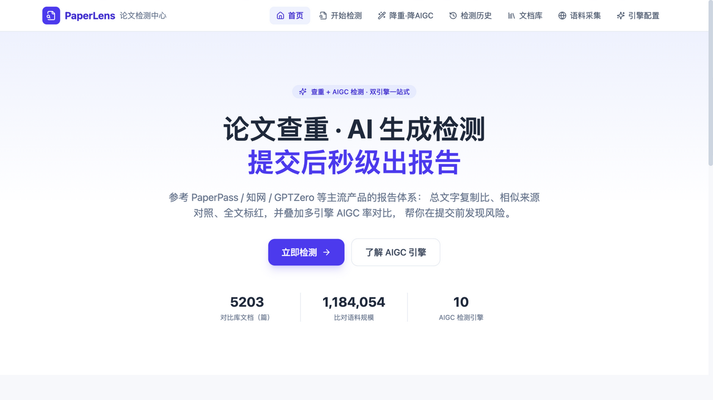
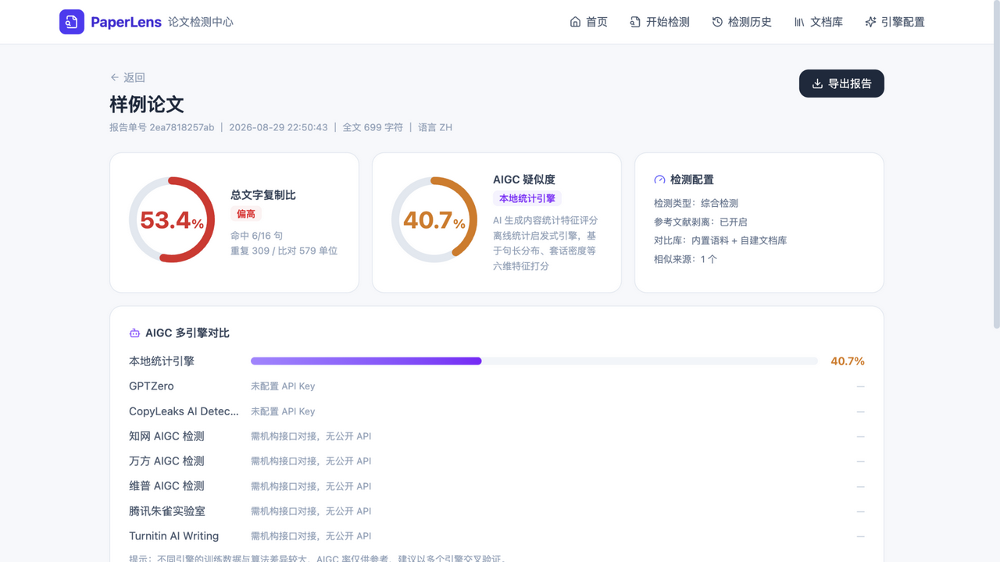
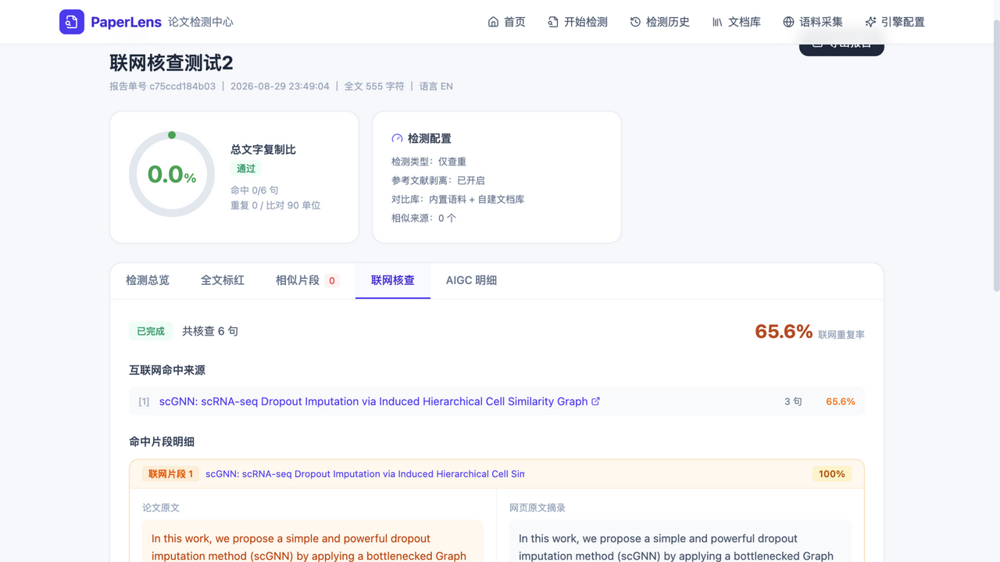
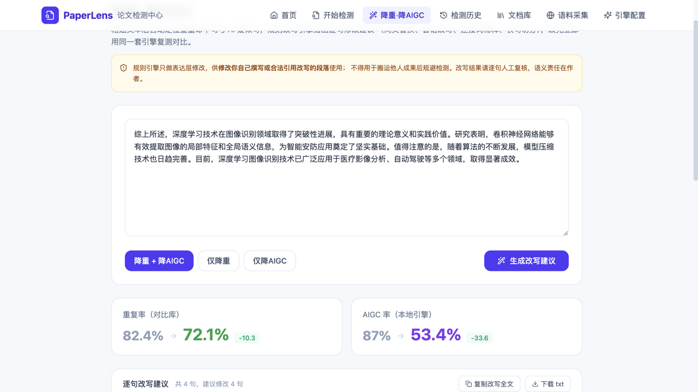
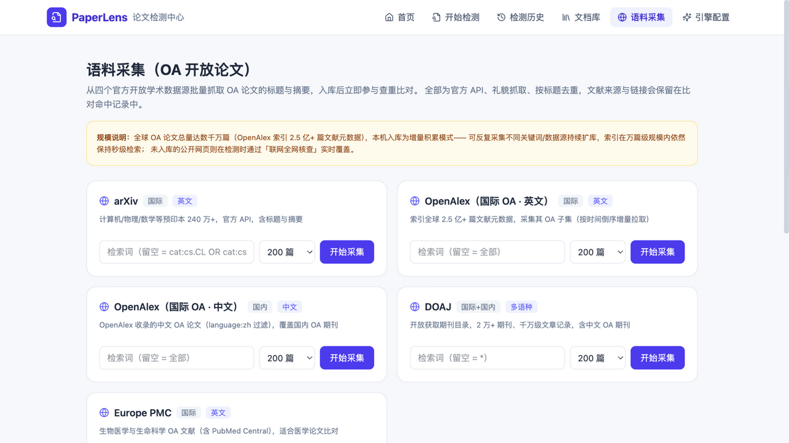

# PaperLens 论文检测中心

<p align="center">
  
</p>

<p align="center">
  <b>本地部署的论文查重 + AIGC 检测 + 联网核查 + 降重改写 一站式平台</b><br/>
  FastAPI · React · SQLite · 完全离线可用的检测内核
</p>

<p align="center">
  <a href="LICENSE"></a>
  <a href="https://github.com/tanyaqiong31029/paperlens/actions/workflows/ci.yml"></a>
  
  
  
</p>

<p align="center">
  <a href="README_EN.md">English</a> ｜ 简体中文
</p>

---

## 这是什么

参考知网 / PaperPass / PaperDog / 笔杆网（国内）与 Turnitin / GPTZero（国际）的产品形态，
把完整的论文自查流程搬到**你自己的机器**上：

| 能力 | 说明 |
|---|---|
| 📄 **文档查重** | 句子级 n-gram 指纹 + 倒排索引召回 + containment 精确比对；中文按字、英文按词双粒度；自动剥离参考文献 |
| 🌐 **联网全网核查** | 可疑句多源检索：OpenAlex / arXiv / Europe PMC 学术库直查（自带摘要免抓页面）+ Bing / DuckDuckGo 兜底，命中标注来源链接与网页原文摘录，单独输出联网重复率 |
| 🕷️ **OA 语料采集** | 内置爬虫从 arXiv / OpenAlex（含中文 OA）/ DOAJ / Europe PMC 四个官方数据源增量扩库，任务进度可视 |
| 🤖 **AIGC 检测（v2 集成引擎）** | 六维统计指纹 + 语料库 n-gram LM 平滑度信号（句间突发性 / token 困惑波动），全文级 + 逐句 AI 疑似度 + 特征雷达 |
| ⚖️ **多引擎对比** | 本地引擎实测 + GPTZero（填 Key 真实调用）+ transformers 模型插件（HC3 检测器 / 自训模型）+ CopyLeaks（实验性，暂不可调用）+ 知网 / 万方 / 维普 / 朱雀 / Turnitin（无公开 API，如实标注） |
| ✂️ **降重 · 降AIGC** | 定位命中句与 AI 疑似句，规则改写（同义替换 / 套话改写 / 连接词稀释 / 长句切分），改完自动复测输出前后对比 |
| 📊 **知网式报告** | 全文标红（本地重复红 / 联网命中橙 / AI 高疑似紫）、片段左右对照、独立 HTML 报告导出 |

<p align="center">
  　
  
</p>
<p align="center">
  　
  
</p>

## 与 GitHub 上同类项目的区别

| 项目 | 形态 | 本项目的差异化 |
|---|---|---|
| [paper_checking_system](https://github.com/tianlian0/paper_checking_system) | Windows 桌面（C#/C++） | 网页产品形态、中英双语、连续串判重之外叠加联网核查与 AIGC 检测 |
| [antiplag](https://github.com/fanghon/antiplag) | 桌面软件（代码/文本/图片） | 面向论文场景的完整 Web 流程：任务管理、历史、报告导出、自建库 |
| [simple-aigc-detect](https://github.com/ni00/simple-aigc-detect) 等 AIGC 检测工具 | CLI / 脚本 | 检测只是环节之一：查重→联网核查→多引擎 AIGC→降重改写 形成闭环，且有可解释的特征雷达 |

核心差异一句话：**不是一个算法 demo，而是一套可自部署、可解释、数据不出本机的完整产品**。

## 快速开始

```bash
bash setup.sh          # 安装后端依赖 + npm ci + 构建前端（只需一次）
bash start.sh          # 默认 http://127.0.0.1:8765 —— 仅本机可访问
```

- 后端：Python 3.10+（FastAPI + SQLite，无重型依赖）
- 前端：Node 18+（React 18 + Vite 5 + Tailwind CSS 4）

开发模式：

```bash
cd backend && python3 -m uvicorn app.main:app --port 8765
cd frontend && npm install && npm run dev    # 5173 端口，已配置 /api 代理
```

### 安全模型（默认最小暴露）

- 默认绑定 **127.0.0.1**，仅本机可访问——适合共享 Wi-Fi、校园网、内网环境直接使用；
- 如确需局域网开放：`PAPERLENS_ADMIN_TOKEN=$(openssl rand -hex 16) HOST=0.0.0.0 bash start.sh 8765 0.0.0.0`，
  非回环地址启动**强制要求管理员令牌**，设置后 `/api` 下除健康/统计/引擎列表外的接口
  （含报告读取、上传、删除、爬虫、Key 配置）均要求 `X-Admin-Token` 请求头；
- CORS 默认**不启用**（同源部署天然可用），跨域需求需显式设置 `PAPERLENS_ALLOW_ORIGINS`；
- 请求体在读取正文前校验大小上限（默认 40MB），检测任务使用有界线程池（并发 2），
  采集任务并发上限 2，防止资源被单个客户端占满。

首次启动建议到「语料采集」页跑一轮采集（arXiv / OpenAlex 各 200 篇约 2 分钟），
把对比库从内置演示语料扩到真实 OA 论文；本地 AIGC 引擎的 n-gram LM 也会随语料自动重建。

## AIGC 检测方法（v2 集成引擎）

检测器设计遵循业界公开方法的演进脉络：GPTZero 早期方案使用 perplexity + burstiness
（Tian & Cui 2023）；DetectGPT（ICLR'23）→ [Fast-DetectGPT](https://arxiv.org/abs/2310.05130)（ICLR'24，
条件概率曲率）→ [Binoculars](https://arxiv.org/abs/2401.12070)（ICML'24，双模型交叉困惑度）
确立了"机器文本在语言模型下更可预测、更平滑"的核心范式；中文侧可参考
[NLPCC 2025 Shared Task 1: LLM-Generated Text Detection](https://github.com/NLP2CT/NLPCC-2025-Task1)
（DetectRL-ZH 中文基准）上的相关系统。

本项目的本地引擎为**离线多信号集成**，不依赖大模型：

```
六维统计指纹（对应 LLM"过于均匀"的生成特征）
  ├─ 句式均匀度   句长变异系数
  ├─ 套话密度     中/英 AI 高频短语命中率（"综上所述" / "delve into" …）
  ├─ 连接词规整度 过渡词密度
  ├─ 词汇中庸度   TTR 到 AI 典型带的距离
  ├─ 标点单一度   标点种类数
  └─ 句式模板化   句首模板重复率
＋ 语料库三元语法 LM 的两个平滑度信号
  ├─ 句间突发性   各句困惑度的变异系数（AI 更平齐）
  └─ token 困惑波动  句内 token log-prob 变异系数

全文分 = sigmoid(Σ 加权特征 − 偏置)
最终 AIGC 率 = 字数加权句级均值 × 0.6 + 全文统计分 × 0.4
```

**校准中一个值得记录的发现**：我们最初使用了"绝对困惑度"信号，但在自建语料 LM 上
实测出现**域内反转**——OA 人类论文的 ppl 反而低于 AI 文本（领域自适应效应），
因此最终版本剔除了绝对 ppl，只保留"波动形状"类平滑度信号。

**固定评测集回归结果**（`backend/evals/aigc_eval.json`，24 条自建中英样本，
运行 `python scripts/eval_aigc.py` 可复现）：

| 子集 | AUROC | 最佳F1（阈值） | FPR@45 | FPR@70 |
|---|---|---|---|---|
| 全部 | 1.000 | 1.000（50） | 0.25 | 0.00 |
| 中文 | 1.000 | 1.000（50） | 0.33 | 0.00 |
| 英文 | 1.000 | 1.000（50） | 0.17 | 0.00 |

**诚实声明**：评测集为自建小样本且与内置语料同源，AUROC=1.000 只说明"本引擎在这组
回归样本上可分"，**不能外推为对真实混合文本的检测精度**。FPR@45=0.25 也如实说明：
45 分阈值会把约四分之一的书面化人类文本标为"疑似"。统计启发式对深度改写的 AI 文本
判别力有限，报告页将其定位为初筛自查工具，并内置 GPTZero / transformers 模型的
多引擎交叉验证；任何单一引擎的 AIGC 率都不应作为学术不端的定论依据。

## 查重算法

召回 + 精判两级流水线（判重思想参考 [paper_checking_system](https://github.com/tianlian0/paper_checking_system)
的连续串阈值法，工程上改为倒排索引方案）：

1. **召回**：对比库按句建 n-gram 倒排索引（中文 8 字 / 英文 6 词 shingle）；
2. **确准**：containment = |交集| / min(|A|,|B|)，中文阈值 0.30 / 英文 0.25；
3. **降噪**：短句（<6 单位）不判、同一句多来源只计一次、相邻相似句合并为标红片段；
4. **口径**：重复率 = 命中句累计单位（去重）/ 全文单位，参考文献自动剥离。

开发时实测规模：**5,200+ 篇 OA 论文 / 118 万比对单位**，单篇论文检测秒级完成；
万篇级库无需外置搜索引擎。

## 联网全网核查

对本地未命中的可疑句（中文 ≥12 字 / 英文 ≥8 词，长句优先）：

1. **学术库直查**（首选）：OpenAlex `title_and_abstract.search`、arXiv `all:"短语"`、
   Europe PMC 摘要短语检索——结果自带摘要，无需抓页面即可比对，命中标注 DOI/链接；
2. **通用网页**：Bing API / SerpAPI（配 Key 优先）→ Bing 网页版 → DuckDuckGo 兜底，
   命中页面抓正文（≤300KB）后做同样的 containment 比对；
3. 礼貌抓取（检索间隔 1.2s）、总时间预算 110s、失败自动降级，输出独立联网重复率。

实测：一篇未入库的 arXiv 论文摘要 → 6 句核查 3 句 100% 命中，正确溯源到原论文。

## 降重 · 降AIGC 改写引擎

- **降重**：对查重命中句做同义替换（中/英安全词表）+ 长句切分，打散指纹连续性；
- **降AIGC**：对高疑似句做套话改写（40+ 中文 AI 高频短语 → 平实表达映射表）、
  句首套式连接词稀释、长句切分；
- 每处改动给出可读理由，改写后自动复测并输出前后对比
  （实测：重复率 82.4%→72.1%，AIGC 87.0%→53.4%）；
- 接口预留 LLM 改写适配位（接 OpenAI / 智谱 / DeepSeek API 后可整体替换规则引擎）。

> 使用边界：仅供修改**你自己撰写或合法引用改写**的段落，不得用于搬运他人成果后规避检测。

## 升级路线（Roadmap）

- [x] 联网全网核查（学术库直查 + 搜索引擎链）
- [x] OA 语料采集（4 官方数据源）
- [x] transformers 模型插件位（`services/aigc/model_engine.py`，装依赖即启用）
- [ ] **中文精度**：接入 NLPCC'25 Task1（DetectRL-ZH）相关冠军方案 /
      社区报告的 MGT-Mini 类轻量模型——设置 `AIGC_MODEL_ZH` 指向权重即可
      （以官方论文与开源权重为准）
- [ ] **英文/多语种**：默认已对接 [Hello-SimpleAI/chatgpt-detector-roberta](https://github.com/hello-simpleai/chatgpt-comparison-detection)；
      可换 RADAR / M4-RoBERTa 等多语种检测器
- [ ] **权威性**：对接各 AI 厂商 / 第三方 AIGC 检测 API，把"统计相对分布"替换为官方判定
      （适配器模式已就绪，参考 `GPTZeroAdapter` 的实现）
- [ ] LLM 改写适配器（降重/降AIGC 质量升级）
- [ ] 语料索引迁移 SQLite FTS5 / Elasticsearch（百万篇级）

## API 一览

```
POST /api/checks                     提交检测（file/text + mode + web_check）
GET  /api/checks/{id}                报告详情        GET /api/checks/{id}/export
POST /api/reduce                     降重/降AIGC 改写（text + mode）
POST /api/library/documents          自建对比库      GET/DELETE /api/library/documents
GET  /api/crawl/sources              OA 数据源       POST /api/crawl/jobs 启动采集
GET  /api/engines                    引擎清单        POST /api/engines/{key}/config
```

## 隐私与数据流向

**默认本地模式（本地查重 + 本地集成引擎 + transformers 插件）：正文不离开这台设备。**

启用以下功能后，会有相应数据发送给第三方，提交页会按启用情况显示提示：

| 功能 | 发送内容 | 接收方 |
|---|---|---|
| GPTZero 引擎（需自行填 Key） | 正文前缀，≤30,000 字符 | GPTZero（api.gptzero.me） |
| 联网全网核查 | 可疑句的归一化检索片段（中文 ≤16 字 / 英文 ≤10 词） | OpenAlex / arXiv / Europe PMC、Bing / DuckDuckGo |
| CopyLeaks（实验性） | 暂不可调用，不发送任何数据 | — |

不启用上述功能时不会产生任何对外请求（OA 语料采集除外，抓取的是公开文献元数据，
与用户论文无关）。

## 数据与合规

- 内置 `seed_corpus/` 为**自撰演示语料**（无版权风险）；真实对比库通过「语料采集」
  从官方 OA API 拉取（标题+摘要+来源链接，礼貌抓取）或自建库上传；
- `backend/data/`（检测历史、已采集语料、API Key）不入库、不出本机；
- API Key 保存在本机 SQLite；默认仅绑定 127.0.0.1，**局域网/公网开放必须配置管理员
  令牌**（见「安全模型」），并自行承担访问控制责任。

## 工程质量

- 后端：`pytest tests/`（25 个用例：分句/指纹/查重口径/参考文献剥离/docx 解析/
  报告导出/改写/API 冒烟/管理令牌/请求体上限），`python scripts/eval_aigc.py`（AIGC 回归评测）
- 前端：`npm run build`（TypeScript 严格模式），依赖审计随 CI 执行
- CI：`.github/workflows/ci.yml` —— 后端测试 + 前端构建 + `npm audit --audit-level=high`
- 后端依赖已在 `requirements.txt` 锁定精确版本；前端由 `package-lock.json` 锁定，
  安装统一走 `npm ci`

## 免责声明

本项目用于学习研究与写作自查。检测结果仅供修改参考，不代表任何官方机构结论；
定稿请以学校指定系统为准。请勿提交涉密或敏感内容；使用降重功能时请遵守所在机构
的学术规范。

## License

[MIT](LICENSE)
